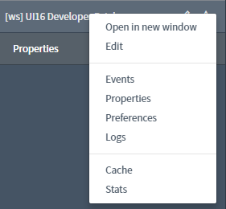
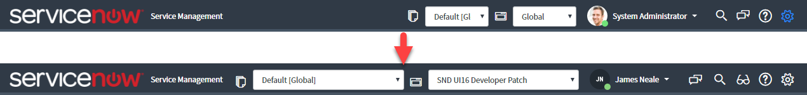
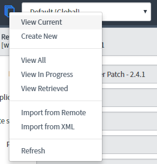
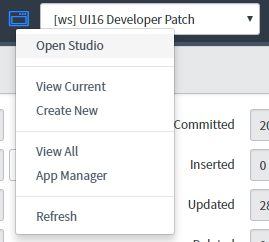
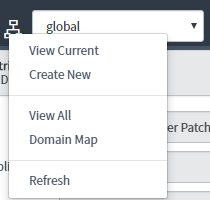
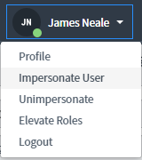

# UI16 Developer Patch

[**Get the Update Set.**](https://share.servicenow.com/app.do#/search-result?search_query=sndeveloper&startRow=NaN&sort_parameter=title)

*UI16 Developer Patch* is an addon for ServiceNow that enhances the UI16
interface to add some features that were taken away in the upgrade to UI16 or
just have never existed. Patches are configurable using system properties and
are applied using a global UI Script.

## Navigator Module Context Menus!

You can right click on any navigator menu application or module and choose
'Edit module' to edit the record.



## Widened Header Dropdown

The choice list drop-downs in the header are 120px wide by default. This makes
them hard to read and work with, so this patch widens all the selectors in the
header, including Update Set, Application and Domain pickers.

The pickers are automatically resized when you resize the browser window or when
you open the global search. They are automatically hidden if there is literally
no room to show them.

The minimum and maximum widths can be controlled using system properties.



## Interactive Icons

By default, the icons in the header next to the Update Set and Application pickers don't do
anything. With this patch, you can now click the icon next to the selector and
it will open an action menu.

### Update Set Menu
Click the icon next to the update set picker to view a list of handy actions.

- View the current update set record.
- Create a new update set.
- View a list of all the update sets in the system.
- View a list of all the update sets that are in progress.
- Go to the Retrieved Update Sets list (admin only).
- Navigate to the Import Set sources table for remote imports.
- Navigate directly to Import an Update Set from XML (admin only).
- Force refresh the selected update set (handy if you use many tabs).



### Application Menu
Click the icon next to the application menu to view a list of handy actions.
- Open the application in Studio
- View the current application record.
- Create a new application.
- View all the application records in the system.
- Go directly to the App Manager.
- Force refresh the selected application (handy if you use many tabs).



### Domain Menu
Click the icon next to the domain menu to view a list of handy actions. This
is restricted to the _domain_admin_ role.
- View the current domain record.
- Create a new domain.
- View all the domain records in the current domain.
- Go directly to the Domain Map.
- Force refresh the selected domain (handy if you use many tabs or might have timed out).



## User Profile Menu

The user profile menu has an 'Unimpersonate' option added so you (and any other
user with the 'Impersonate User' option) now have a handy link to quickly exit
impersonation.



## Custom Properties

The application uses a number of system properties which you can use to configure how the application works. You can view these properties in the application menu: *[ws] UI16 Developer Patch > Properties*.

## Custom Menu Items

It is possible for you to modify and add your own menu items. This is done using the UI Script *snd_ui16_developer_patch_menus*.

This script contains an object containing a series of generator functions that return an array of menu items.

You can add, remove or modify these menu items to suit. Comments have been added to point you in the right direction for each menu.

### Menu Item

A menu item is an object:

```javascript
{
  // Required. The name of the menu item, i.e. what you click on.
  name: "My view",

  // Optional. Do anything you like in the client using this function.
  fn: function (options) {
    alert('Hey!');
  },

  // Optional. Restrict to a specific role (just in case).
  role: 'admin',

  // Optional. Specify the target window to open the url in. Optional. Default 'gsft_main'.
  target: '_blank',

  // Optional. The url you want to open.
  url: '/incident_list.do'
}
```

The *target* and *url* properties can also be functions. Each menu type passes in an options object containing contextual properties for the item selected.

```javascript
{
  name: 'Open in new window',
  target: function (options) {
    return options.module.$id;
  },
  url: function (options) {
    if (options.module.hasClass('nav-app') || options.module.hasClass('app-node')) {
      return '';
    }
    return options.module.attr('href');
  }
}}
```

All functions are passed two parameters: *options* and *config*.

The *options* object contains contextual properties specific to the menu/item being used.

The *config* object contains the system properties for you system.

### Config Properties

__*config.navigator.width*__ Modify the width of the navigator in pixels. Default 285.

__*config.navigator_context.active*__ Allow the navigator to be patched. Default true.

__*config.navigator_context.hide_pencil*__ Hide the pencil icon from later versions of UI16 (use Edit in context menu instead).

__*config.picker_width.active*__ Allow the pickers to be patched. Default true.

__*config.picker_width.max_width*__ Set the maximum width in pixels of the pickers. Default 300.

__*config.picker_width.min_width*__ Set the minimum width in pixels of the pickers. Default 60.

__*config.picker_width.load_timeout*__ The time in ms to wait so that everything can load. Default 2000.

__*config.picker_width.max_search_width*__ The width of the header search box when it has focus. Default 150.

__*config.picker_icon.active*__ Allow the picker icons to be patched. Default true.

__*config.picker_icon.domain_table*__ The name of table being used to manage domains.

__*config.profile_menu.active*__ Allow the profile menu to be patched. Default true.

__*config.profile_menu.check_impersonation*__ Check if the user is being impersonated so the Unimpersonate menu item can be added. This performs an AJAX query.

__*config.profile_menu.link_preferences*__ Show a link to the user's preferences on the User Profile menu.

## General

The patch is deployed as a ServiceNow global application.

An application menu is installed which gives easy access to properties
that control the patches.

## License

[MIT Licence](https://github.com/sn-developer/spoke/blob/master/LICENSE.md)
